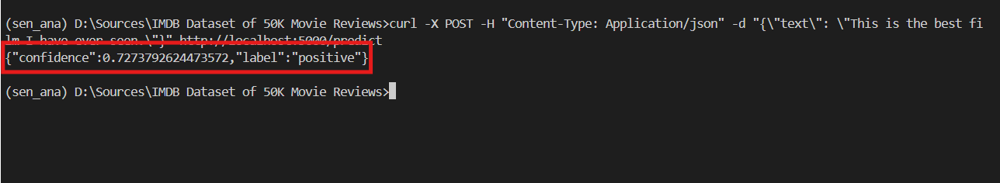

# Sentiment analysis
Sentiment analysis is **the process of analyzing digital text to determine if the emotional tone of the message is positive, negative, or neutral.**
Sentiment analysis, also known as opinion mining, is an important business intelligence tool that helps companies improve their products and services.
 - **Provide objective insights**
 -  **Build better products and services**
 -  **Analyze at scale**
 -  **Real-time results**
Reference: https://aws.amazon.com/what-is/sentiment-analysis/?nc1=h_ls

## Dataset
IMDB dataset having 50K movie reviews for natural language processing or Text analytics.

This is a dataset for binary sentiment classification containing substantially more data than previous benchmark datasets. We provide a set of 25,000 highly polar movie reviews for training and 25,000 for testing. So, predict the number of positive and negative reviews using either classification or deep learning algorithms.

For more dataset information, please go through the following [link](http://ai.stanford.edu/~amaas/data/sentiment/)

Dataset has balance distribution in labels:

Sample text: 

### Preprocessing
Do preprocess steps:
1. Remove punctuation marks 
2. Remove HTML tags
3. Remove URL's 
4. Remove characters which are not letters or digits
5. Remove successive whitespaces
6. Convert the text to lower case 
7. strip whitespaces from the beginning and the end of the reviews 

## Model and training

To deal with the IMDB dataste propblem, go to finturing the pretrained Roberta Model from hugging-face, then add the additional Multilayer Neural Network for classification the text as ***positive*** or ***negative***

After training 5 epochs we got the curve of loss and accuracy as the image below

Accuracy on test dataset is about: 88%

## Installation

### Install python and dependences
1. [Install python 3](https://www.python.org/downloads/)
2. Create virtual environment (optional)

		python3 -m venv <name_of_virtualenv>
	    [In cmd.exe]
	    venv\Scripts\activate.bat
	    [In PowerShell]
	    venv\Scripts\Activate.ps1

3. Install python dependencies:

		pip install -r requirements.txt

4. Download [model checkpoints](https://drive.google.com/file/d/1S2hEivPARb-Xj0xPd3Gm_Uddh49hcqOO/view?usp=sharing) to the project folder.

4. Start flask app on http://localhost:5000

		flask --app app run

5. Call API

    curl -X POST -H "Content-Type: Application/json" -d "{\"text\": \"This is the best film I have ever seen.\"}" http://localhost:5000/predict

Application after run:

Sample result:

# Brief summary the steps of the project

# Time to complete

| Item 									| Time (hour) |
|---------------------------------------|-------------|
| Research about Sentitment Analysis 	|     4		  |	
| Explore dataset						|     4		  |
| Coding for training and testing		|     8	  	  |
| Coding for API Flask app				|     2		  |
| Training and fine turning				|     18	  |
| Documentation							|     2       |
| **Total**								|     38      |

